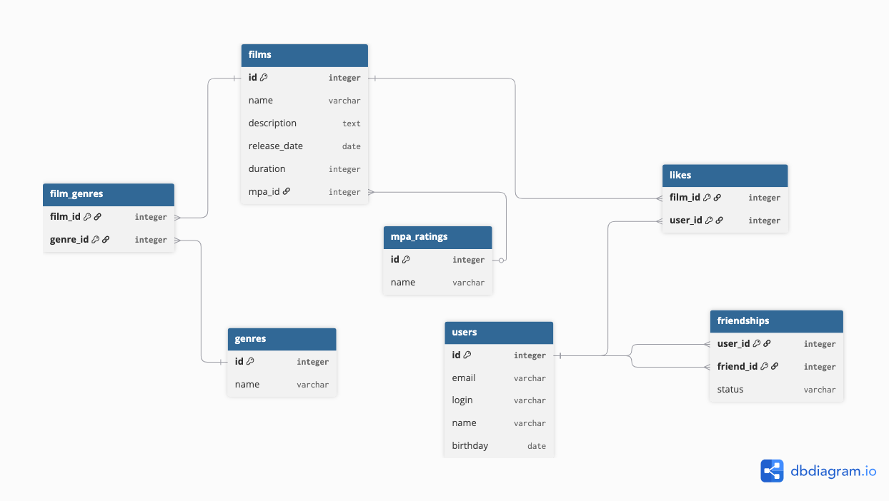

# java-filmorate
Template repository for Filmorate project.

## Database Schema
[](docs/java-filmorate-db.png)

### Get Top Popular Films

```sql
SELECT f.id,
       f.name,
       COUNT(l.user_id) AS likes
FROM films f
LEFT JOIN likes l ON f.id = l.film_id
GROUP BY f.id
ORDER BY likes DESC
LIMIT 10;
```

### Get Films by Genre

```sql
SELECT f.id,
       f.name,
       g.name AS genre
FROM films f
JOIN film_genres fg ON f.id = fg.film_id
JOIN genres g ON fg.genre_id = g.id
WHERE g.name = 'Comedy';
```

### Get User's Friends

```sql
SELECT u.id,
       u.login,
       u.name
FROM users u
JOIN friendships f ON u.id = f.friend_id
WHERE f.user_id = 1
  AND f.status = 'confirmed';
```

### Get Common Friends Between Two Users

```sql
SELECT f1.friend_id
FROM friendships f1
JOIN friendships f2 ON f1.friend_id = f2.friend_id
WHERE f1.user_id = 1
  AND f2.user_id = 2
  AND f1.status = 'confirmed'
  AND f2.status = 'confirmed';
```
